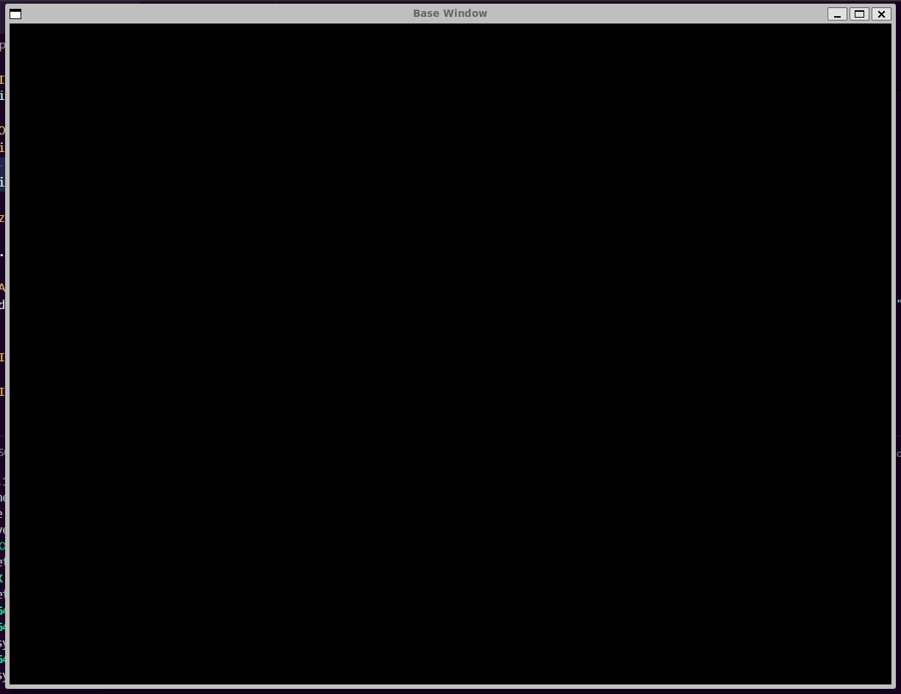

# TAPPA 00 - CREAZIONE BASE DELLA FINESTRA 

## OBBIETTIVO DELLA TAPPA:
Creazione della finestra SFML e gestione dei suoi eventi di base: 
- chiusura della finestra 
- ridimensionamento della finestra
- loop di interazione 

## COSA È STATO IMPLEMENTATO: 
- La finestra è stata creata con: 
    * titolo: Base Window 
    * dimensione 1200x900 
    * Limite di frame: 60 
    * sfondo nero
- Gli eventi sono stati gestiti tramite callback tipizzate (handle events). 
- L'handler del ridimensionamento fa in modo che la finestra mantenga sempre un rapporto 4:3
- Viene impostata un grandezza minima della finestra equivalentemente alla dimensione iniziale della finestra (quindi 1200x900). 
- Alla fine la finestra viene mostrata a schermo

## ISTRUZIONI PER ESEGUIRE DA TERMINALE: 
#### Creazione della build: 
cmake -S . -B build   
cmake --build build -j

#### Esecuzione: 
cd build   
./Tappa00

## VERIFICA DEL RISULTATO: 
All'invio dell'ultimo comando per l'esecuzione dovrebbe aprirsi una finestra vuota delle dimensioni 1200x900 e con il titolo "Base Window".  
Allego uno screenshot del risultato da me ottenuto:  

## PROBLEMI RISCONTRATI E SOLUZIONI: 
Nessuno (per motivazione spiegata nel punto sottostante).

## FONTI DI RIFERIMENTO UTILIZZATE: 
Per questa tappa è stato utilizzato il codice sviluppato per il laboratorio 3 sviluppato durante le lezioni insieme al professor Puppo.  
Sono solo stati aggiunti dei commenti e cambiata la dimensione della finestra e il titolo. 
