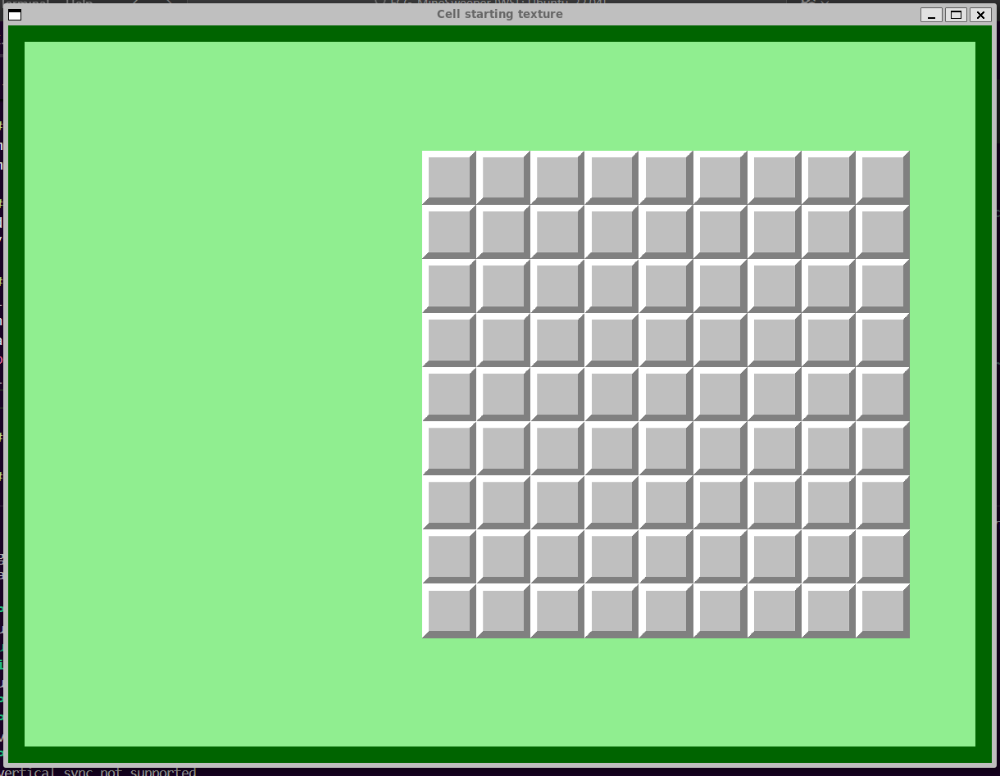

# TAPPA 1A - SFONDO E CELLA 9X9 

## OBBIETTIVO DELLA TAPPA: 
Sviluppo unicamente della grafica dello sfondo di gioco e della griglia 9x9.

## COSA È STATO IMPLEMENTATO: 
Dalla tappa precedente sono stati implementati: 
- un nuovo colore di sfondo verde chiaro 
- un bordo alla finestra creando una Rectangle Shape trasparente leggermente più piccola della finestra e con bordo verde scuro in modo che solo il bordo del rettangolo fosse visibile 
- Un oggetto 'griglia' tramite struct fatto di celle con uan etxture grigia. Questo sarà come apparirà la griglia di gioco all'inizio di ogni partita con modalità facile. 
- Un oggetto 'cell' tramite struct che corrisponderà alle varie celle di gioco. Per ora detto oggetto ha solo una texture possibile 'Covered' 
- Un oggetto 'state' tremite struct che corrisponde allo stato di gioco 

Tutto ciò che è stato elecanto fino ad ora viene messo su display tramite funzioni draw() e display(). 

## ISTRUZIONI PER ESEGUIRE DA TERMINALE: 
cmake -S . -B build   
cmake --build build -j

#### Esecuzione: 
cd build   
./Tappa1a

## VERIFICA DEL RISULTATO: 
All'invio dell'ultimo comando per l'esecuzione dovrebbe aprirsi una finestra intitolata "Cell starting texture" con sfondo verde chiaro e bordo verde scuro e in basso a destra un griglia 9x9 di celle con una texture grigia. 
 
Allego uno screenshot del risultato da me ottenuto:  

## PROBLEMI RISCONTRATI E SOLUZIONI: 
#### PROBLEMA: 
Inserire un bordo non per una figura ma per la finestra stessa. 
#### SOLUZIONE: 
Non essendoci un comando diretto su SFML per inserire un bordo alla finestra ho optato per creare inizialmente un rettangolo transparente, con solo il bordo colorato, delle stesse dimensioni della finestra e con origine in (0,0).  
Ciò però ha portato ad un nuovo problema: il bordo veniva disegnato al di fuori delle dimensioni del rettangolo ed essendo il rettangolo delle stesse dimensioni e origini della finestra, il bordo veniva tagliato fuori.    
Per risolvere il problema ho ridimensionato il rettangolo di 40 pixel in meno in larghezza e altezza, e ho spostato la sua origine in (20,20) (pari allo spessore del bordo). In questo modo il bordo viene interamente disegnato all’interno dell’area visibile della finestra. 

## FONTI DI RIFERIMENTO UTILIZZATE:  
Nessuna

