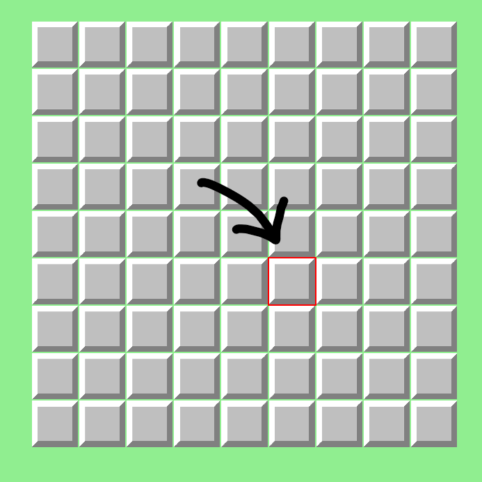
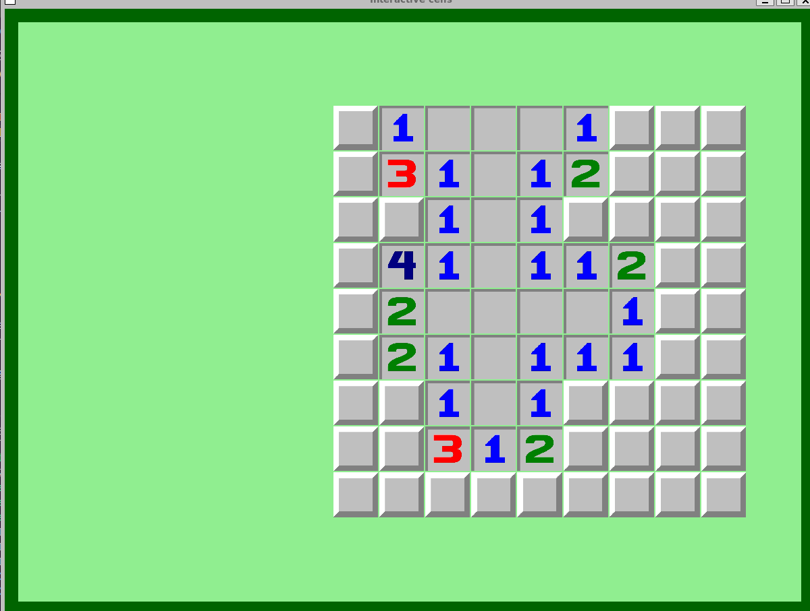
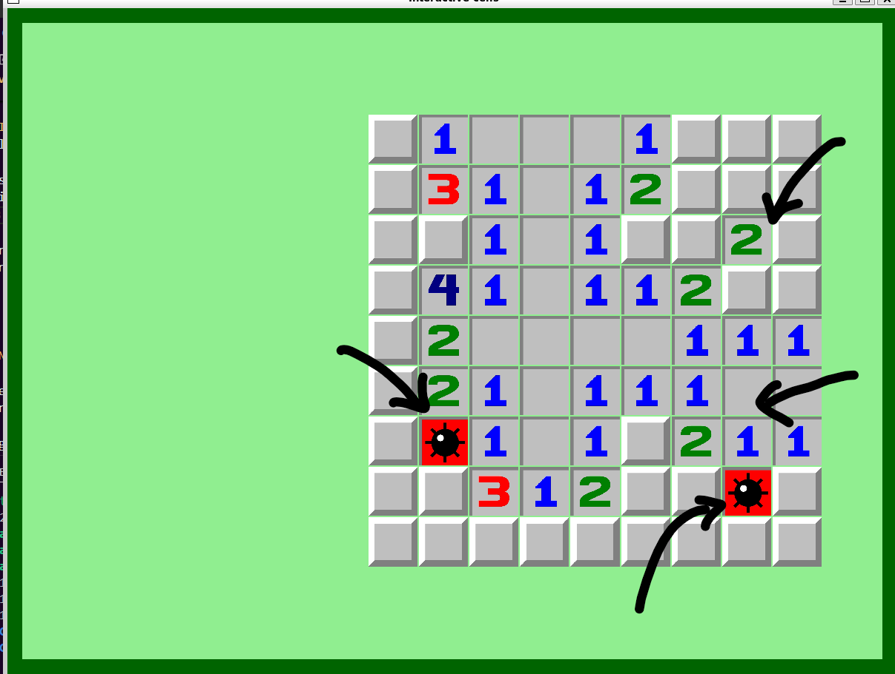
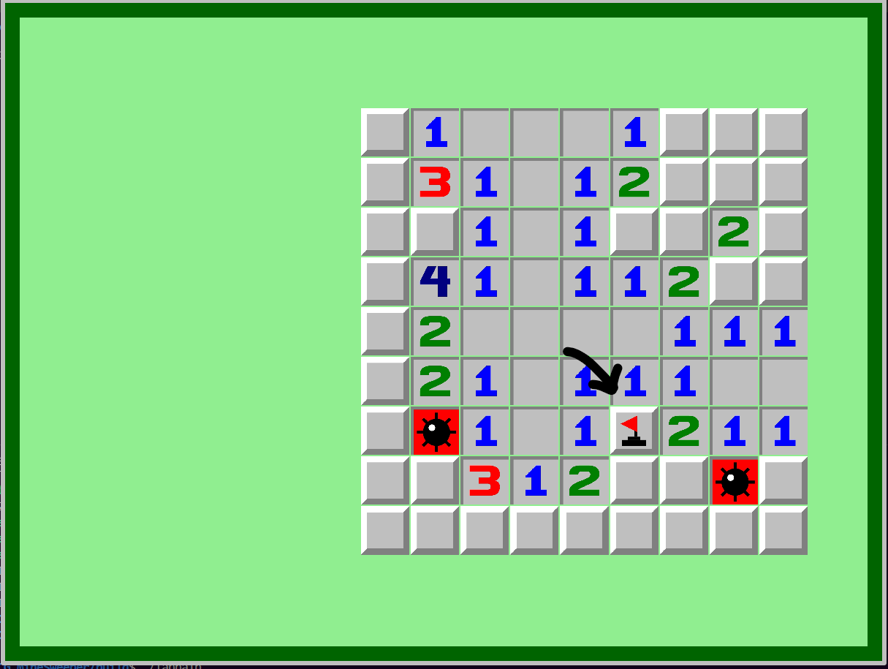

# TAPPA 1B - CELLE INTERATTIVE 

## OBBIETTIVO DELLA TAPPA: 
Rendere le celle interattive, in particolare fare in modo che: 
- al solo passaggio del mouse su una cella il bordo di detta cella diventi rosso per indicare che la cella ha il focus 
- Il primo click sinistro sulla griglia in una cella qualsiasi faccia partire una rivelazione a catena di celle a partire dalla cella appena cliccata 
- dopo il primo click: 
    * ogni click sinistro su una cella coperta faccia rivelare detta cella e in caso detta cella sia empty faccia anche partire una rivelazione a cascata di celle adiacenti 
    * ogni click destro su una cella coperta permetta mettere o togliere le bandierine da una cella Covered 

## COSA È STATO IMPLEMENTATO: 
Rispetto alla tappa precedente:
- è stato implementato un file hpp a parte chiamato 'textures.hpp' per il contenimento e controllo di tutte le texture che verranno utilizzate nel gioco 
- sono state implementate diverse funzioni per la gestione degli eventi: 
    * è stata gestita la possibilità di eventi non programmati tramite una funzione di gestione generica con corpo vuoto 
    * è stato gestito il passaggio del muose su una cella in modo che il bordo diventi rosso 
    * è stato gestito l'evento di perdita e presa di focus della finestra di gioco 
    * è stato gestito l'evento di click sinistro su una cella che: 
        * nel caso la cella sia di tipo Covered o Flag riveli la cella tramite la funzione 'reveal' e: 
            * nel caso la cella sia di tipo Mine per ora riveli solo la mina esplosa e basta e imposti come sua texture quella della mina esplosa (Exploded_Mine_texture)
            * nel caso la cella sia di tipo Number riveli il numero di mine adiacenti alla cella considerata impostando la sua texture come quella del numero corrispondente (numbers[num_mine_adiacenti-1])
            * nel caso la cella sia di tipo Empty o sia la prima cella cliccata in partita, venga impostata come sua texture quella della cella vuota (Empty_texture) e faccia partire una flood_reveal 
        * nel caso la cella sia di tipo Revealed non faccia nulla 
    * è stato gestito l'evento di click destro su una cella che: 
        * nel caso non sia stata fatta la prima mossa oppure la cella sia nello stato Revealed non faccia nulla 
        * nel caso la cella sia già nello stato Flag verrà tolta la bandierina dalla cella (texture e stato Covered)
        * negli altri casi metta una bandierina sulla cella (texture e stato Flag) 

- CASO PARTICOLARE PRIMA MOSSA: <br>
    Come da regole di gioco è stato fatto in modo che: 
    * la prima cella cliccata e le 8 celle a lei adiacenti non siano mine
    * solo dopo che è stata cliccata la prima cella venga fatto partire il meccanismo di posizionamento delle mine nella griglia in modo casuale andando ad escludere la prima cella cliccata e le adiacenti ad essa 
    * dopo il posizionamento delle mine, venga messo il tipo della cella in base al fatto che sia una mina o il numero di mine a lei adiecenti
    * a causa del fatto che la prima cella e le sue adiacenti non conterrano mai delle mine e la prima cella sarà sempre di tipo empty, quest'ultima farà sempre partire una flood reveal

## ISTRUZIONI PER ESEGUIRE DA TERMINALE: 
Prima di poter scrivere questo comando su terminale, bisogna aver: 
- creato la cartella build 
- configurato tramite cmake 
- compilato con make 

```bash
cd build 
./Tappa1b
```

## VERIFICA DEL RISULTATO:
#### N.B: Le frecce nelle foto sono per indicare un particolare del risultato (tipo la cella con focus del mouse al momento dello screenshot). Non devono comparire nel risultato
#### FOCUS: 
Al passaggio del mouse su una cella essa dovrebbe avere il bordo illuminato di rosso <br> <br>
Allego uno screenshot del risultato da me ottenuto:


#### PRIMA MOSSA:
Al primo click sinistro su un cella coperta dovrebbe partire sempre una rivelazione a catena <br> <br>
Allego uno screenshot del risultato da me ottenuto:  


#### RIVELAZIONE CELLA:   
Al click sinistro dopo il primo su una cella sinistra non rivelata, la cella dovrebbe rivelarsi (mina, vuota, numero). Il numero rivelato da un cella dovrebbe corrispondere al numero di mine a lei adiacenti <br> <br>
Allego uno screenshot del risultato da me ottenuto:  


#### CELLA RIVELATA: 
Cliccare su una cella già rivelata non dovrebbe portare ad alcuna azione.

#### BANDIERINA: 
- Al click destro su una cella coperta dovrebbe apparire una bandierina su detta cella
- Al click destro su una cella con bandierina la cella dovrebbe tornare coperta facendo sparire la bandierina <br> <br>
Allego uno screenshot del risultato da me ottenuto:  


## PROBLEMI RISCONTRATI E SOLUZIONI:
#### PROBLEMA:  
Ho voluto aggiungere la caratteristica che la cella su cui passa il mouse venisse illuminata con il bordo rosso, come indicato precedentemente, per dare un senso di focus. Detto bordo però veniva in parte coperto dalle altre celle adiacenti.
#### SOLUZIONE: 
Ho aggiunto un leggero gap (2.f) della stessa grandezza del bordo tra le celle. 

#### PROBLEMA: 
Nella versione precedente del codice si salvava per ogni cella solamente la sua posizione nella finestra ma non il suo indice riga/colonna nella griglia. Senza quel dato però non si poteva implmentare la flood reveal o accertare il fatto che le celle adiacenti alla prima della cliccata non fossero mai di tipo Mine. 
#### SOLUZIONE: 
Sono stati aggiunti questi due parametri in modo da averli a portata di mano senza doverli ogni volta calcolare. 

#### PROBLEMA: 
la resize non funzionava 

## FONTI DI RIFERIMENTO UTILIZZATE: 
Nessuna (oltre a quelle utilizzate nelle tappe precedenti).

