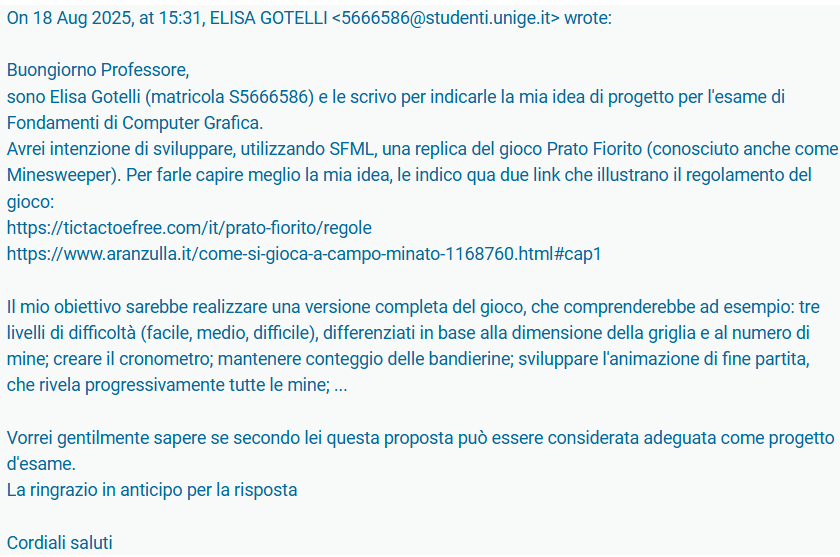
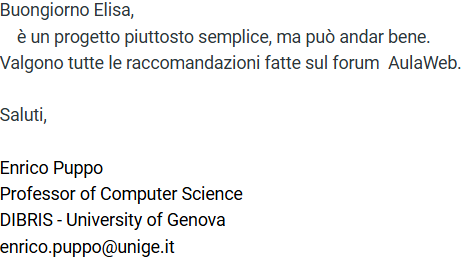

# Accettazione del progetto: 

# Suddivisione in almeno 10 tappe: 
Per ciascuna tappa: 
- deve essere creata una cartella a sè contentente: compilabile/visualizzabile/eseguibile 
- deve essere salvato un file di progetto fino a quello stadio di codice compilabile e funzionante  
- deve essere possibile avere un risultato parziale visibile 
- deve essere uno stadio di sviluppo ben preciso del progetto 
- breve documento pdf in cui: 
    * si descrive come si è arrivati al risultato ottenuto 
    * si indicano gli ostacoli/problemi incontrati durante lo sviluppo della tappa e come si sono risolti 
    * degli screenshots 
    * deve essere di poche righe 
    * si deve dichiarare se si sono presi pezzi di codice online 
- devono esserci TUTTI i file necessari per la compilazione 
- se si usano pezzi di codice presi online bisogna dichirarrlo esplicitamente della documentazione

# STRUTTURA DEL PROGETTO: 

# TEMPO DI CONSEGNA: 
Una settimana prima della data dell'orale 

# VERSIONI CONSENTITE: 
SOLO SFML 3.0 
    
# METODI DI CONSEGNA: 
- fatta su aulaweb 
- consentito solo un file da 20 MB 
- per repo Git creare un file testo contenente solo il link alla repo 

